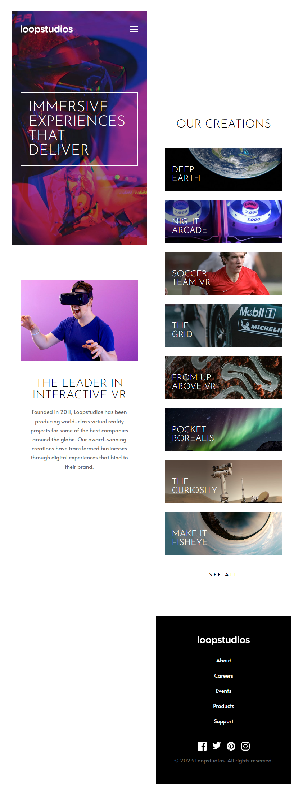

<h1 align="center">Loopstudios Landing Page</h1> 

<table >
  <tr>
    <th>Desktop</th>
    <th>Mobile</th>
  </tr>
  <tr>
    <td style="text-align: center;"> 
      
    </td>
    <td style="text-align: center;">
      
    </td>
  </tr>
</table>

  <h2><a href="https://veraenders.github.io/loopstudios-landing-page/">Live</a>
   |  
  <a href="https://github.com/VeraEnders/loopstudios-landing-page/">Code</a></h2>
  
This is a solution to the <a href="https://www.frontendmentor.io/challenges/loopstudios-landing-page-N88J5Onjw">Loopstudios landing page</a> challenge on FrontendMentor.

 

## About the project 
Your challenge is to build out this landing page and get it looking as close to the design as possible.

Users should be able to:

> View the optimal layout for each page depending on their device's screen size

> See hover states for all interactive elements throughout the site

## Built with

- Semantic HTML5 markup
- SCSS
- JavaScript
- Mobile-first workflow
- [ViteJS](https://vitejs.dev/) - A local development server

## Author

GitHub - [VeraEnders](https://github.com/VeraEnders)